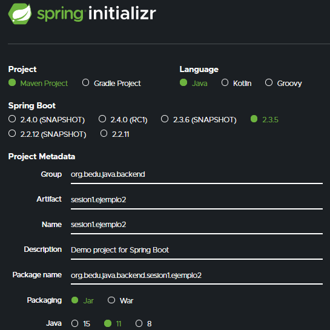

## Ejemplo : Creación de proyecto Maven con Spring Initializr

### Objetivo
- Aprender la forma de crear un proyecto Maven usando Spring Initlizr.
- Compilar, empaquetar y ejecutar la aplicación o proyecto generados desde la línea de comandos.
- Ejecutar la aplicación desde la línea de comandos.

#### Requisitos
1. Tener instalado la última versión del JDK 11 (De Oracle u OpenJDK).
2. Tener una conexión a Internet.

#### Desarrollo

1. Entra al sitio de [Spring Initializr](https://start.spring.io/). Ahí verás una sola página dividida en dos secciones. Comienza llenando la información de la sección del lado izquierdo. Selecciona:
  - Tipo de proyecto: **Maven Proyect**.
  - Lenguaje: **Java**.
  - Versión de Spring Boot, la versión estable más reciente (al momento de escribir esto la **2.3.5**)
  - Grupo, artefacto y nombre del proyecto.
  - Forma de empaquetar la aplicación: **jar**.
  - Versión de Java: **11**.

2. En la sección de la derecha (las dependencias) presiona el botón `Add dependencies` y en la ventana que se abre busca la dependencia `Web` o `Spring Web`.

3. Selecciona la dependecia `Spring Web` y con eso debes verla en la lista de las dependencias del proyecto:

 

3. Presiona el botón "GENERATE" (o presiona `Ctrl` + `Enter` en tu teclado) para que comience la descarga del proyecto.

4. Descomprime el archivo `zip` descargado, el cual tiene más o menos el siguiente contenido.

5. Abre una terminal o línea de comandos en el directrio que acabas de descomprimir y ejecuta los siguientes comandos, los cuales se ejecutan en **Maven** gracias a un *wrapper* que se distribue dentro del paquete que acabas de descargar (Nota: si es la primera vez que ejecutas Maven en tu computadora, el comando tardará un buen rato en ejecutarse, ya que debe descargar las librerias y paquetes necesarios):

        mvnw clean package
      
6. La salida del comend anterior debe ser parecida a la sigueinte:

7. Una vez que todo está compilado, usa el siguiente comando para ejecutar la aplicación. 

        mvnw spring-boot:run
        
8. Debes obtener una salida similar a la siguiente:

Esto indica que la aplicación se levantó correctamente en el puerto **8080**. Como no hemos colocado ningún contenido en la aplicación no hay mucho que mostrar, pero podremos comprobar que la aplicación está bien configurada, que todos los elementos necesario están instalados y configurados y que nuestra aplicación se ejecuta de forma correcta:

      http://localhost:8080
      
Una vez que el sitio cargue, debes ver una pantalla como la siguiente:

9. Deten la aplicación presionando `Ctrl + C` en la terminal en donde levantaste la aplicación.

Puesto que la aplicación está completamente contenida en un archivo `jar`, también es posible ejecutarla de otra forma.

10. Al compilar la aplicación con `mvnw package` se creó un directorio `target`. Navega a este directorio, el cual debe contener, entre otras cosas, un archivo `jar`.

11. Abre una terminal en este directorio y ejecuta el siguiente comando (cambia el nombre del jar si en tu caso es diferente):

        java -jar sesion1.ejemplo2-0.0.1-SNAPSHOT.jar
        
12. Con esto nuevamente debes obtener una salida como la siguiente:

Nuevamente, esto indica que la aplicación se levantó correctamente en el puerto **8080**. Como no hemos colocado ningún contenido en la aplicación no hay mucho que mostrar, pero podremos comprobar que la aplicación está bien configurada, que todos los elementos necesario están instalados y configurados y que nuestra aplicación se ejecuta de forma correcta:

      http://localhost:8080
      
Una vez que el sitio cargue, debes ver una pantalla como la siguiente:

